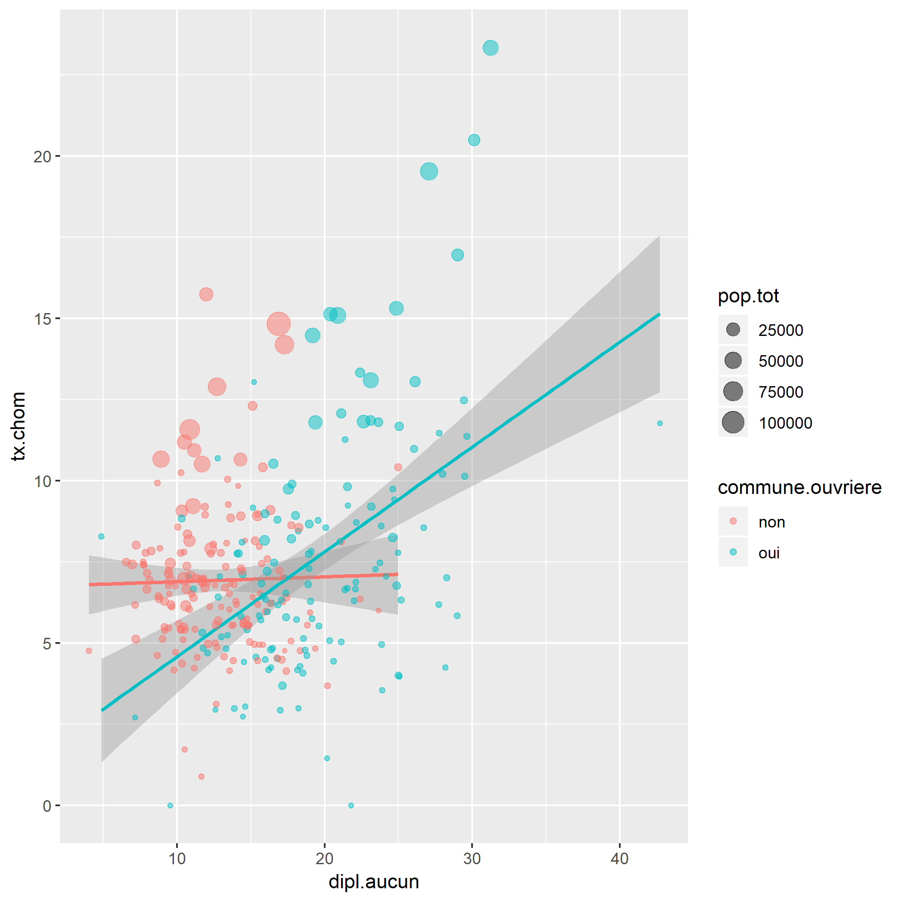
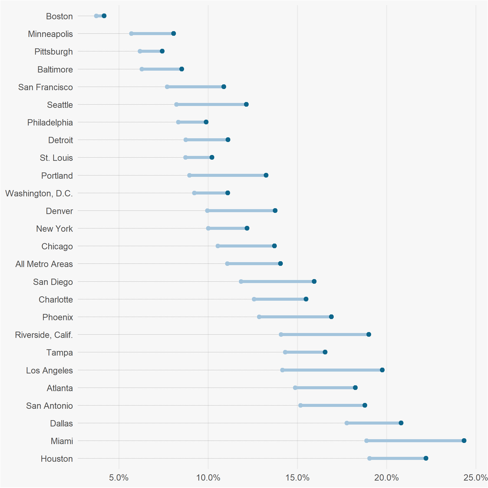

ggplot2 ou la grammaire des graphiques sous R
========================================================
author: Joseph Larmarange, Ceped IRD
date: Rencontres de statistiques appliquées, Ined, 18 juin 2018
autosize: true
css: custom.css


R
========================================================

- logiciel libre et gratuit
- multi-plateforme (Windows, MacOS, Linux)
- nombreuses fonctions d'import et d'export des données
- développement très actif (plus de 10 000 extensions)
- de plus en plus utilisé dans la communauté scientifique
- interface graphique la plus commune : **RStudio**
- rapports automatisés avec **Rmarkdown**
- interfaçage possible avec bases SQL
- serveurs de calcul en ligne (cf. <https://r-tools.huma-num.fr>)


R et les graphiques
=========================================================

**R** dispose d'un puissant moteur graphique interne.

Exemples en ligne : <https://www.r-graph-gallery.com/>

**Fonctions graphiques de base :**

- permettent de dessiner dans un graphique (ajout de points, segments, étiquettes...)
- mais fonctions peu intuitives
- la production d'un graphique complet nécessitent pas mal d'étapes et de codes

R et les graphiques (suite)
=========================================================

Heureusement, il existe de nombreuses extensions graphiques pour **R**, dont (liste non exhaustive)

- **lattice**, particulièrement adapté à la visualisation de panels et de séries temporelles
- **circlize** pour les visualisations circulaires
- **igraph** ou **DiagrammeR** pour les réseaux
- **LexisPlotR** pour les diagramme de Lexis

ggplot2
========================================================
type: sub-section

- extension développée par Hadley Wickham
- met en œuvre la grammaire des graphiques théorisée par Leland Wilkinson
- est devenue en quelques années l’une des extensions R les plus utilisées
- appartient au **tidyverse**, un ensemble d'extensions dédiées à l'analyse de données

Le tidyverse
========================================================


Données tidy
========================================================

Le concept de tidy data repose sur trois règles interdépendantes. Des données sont considérées comme tidy si :

1. chaque ligne correspond à une observation
2. chaque colonne correspond à une variable
3. chaque valeur est présente dans une unique case de la table ou, de manière équivalente, si des unités d’observations différentes sont présentes dans des tables différentes

Exemples de données non tidy
========================================================


|pays    |     1992|     1997|     2002|     2007|
|:-------|--------:|--------:|--------:|--------:|
|Belgium | 10045622| 10199787| 10311970| 10392226|
|France  | 57374179| 58623428| 59925035| 61083916|
|Germany | 80597764| 82011073| 82350671| 82400996|

Les mêmes données au format tidy
============================================


|pays    | annee| population|
|:-------|-----:|----------:|
|Belgium |  1992|   10045622|
|France  |  1992|   57374179|
|Germany |  1992|   80597764|
|Belgium |  1997|   10199787|
|France  |  1997|   58623428|
|Germany |  1997|   82011073|
|Belgium |  2002|   10311970|
|France  |  2002|   59925035|
|Germany |  2002|   82350671|
|Belgium |  2007|   10392226|
|France  |  2007|   61083916|
|Germany |  2007|   82400996|

Grammaire des graphiques
========================================================

La **grammaire des graphiques** invite l’utilisateur à repenser sa manière de concevoir un graphique en associant variables (données), paramètres graphiques (esthétiques) et formes géométriques, puis en complexifiant progressivement son graphique (coordonnées, échelles, facettes, étiquettes, légendes, thèmes…).

***


Un premier exemple
========================================================
type: sub-section


Présentation des données
======================================================

<small>Extrait des données du recensement français de 1999.<br />
Une ligne par commune du département du Rhônes.</small>


|nom               |   tx.chom| dipl.aucun| pop.tot|commune.ouvriere |
|:-----------------|---------:|----------:|-------:|:----------------|
|AFFOUX            |  3.539823|   23.91304|     248|oui              |
|AIGUEPERSE        |  7.777778|   25.00000|     233|oui              |
|ALBIGNY-SUR-SAONE | 10.407632|   24.97721|    2680|non              |
|ALIX              |  4.693141|   12.06294|     690|oui              |
|AMBERIEUX         |  7.042254|   24.15902|     427|oui              |

<small>**Variables :** taux de chômage, proportion de la population adulte n'ayant aucun diplôme, population totale, commune considérée comme ouvrière (si plus d'un quart de la population active est ouvrière).</small>

Un nuage de points
========================================================

<small>A minima, **ggplot2** nécessite : (i) des *données* ; (ii) l'association entre des *variables* et des *esthétiques* et (iii) une *géométrie*.</small>


```r
library(ggplot2)
p <- ggplot(rp99) +
  aes(x = dipl.aucun, y = tx.chom) +
  geom_point()
```

<small>A noter : **ggplot2** repose sur une syntaxe additive.</small>

***


Ajouter des esthétiques
========================================================


```r
p <- ggplot(rp99) +
  aes(x = dipl.aucun, y = tx.chom, colour = commune.ouvriere, size = pop.tot) +
  geom_point(alpha = .5)
```

<small>**Note :** il est possible de fixer la valeur d'une *esthétique* non assiciée à une variable, lors de l'appel à une *géométrie*.</small>

***


Ajouter une géométrie
========================================================


```r
p <- ggplot(rp99) +
  aes(x = dipl.aucun, y = tx.chom, colour = commune.ouvriere, size = pop.tot) +
  geom_smooth(method = "lm", show.legend = FALSE) +
  geom_point(alpha = .5)
```

<small>**Note :** certaines *géométries* sont associées à une *statistique*. Nous y reviendrons plus tard.</small>

***




Une question d'échelles
========================================================

<small>Les *échelles* permettent de contrôler le rendu des *esthétiques*.</small>


```r
p <- p +
  scale_x_continuous(limits = c(0, 45)) +
  scale_y_continuous(breaks = c(0, 10, 15, 20, 25)) +
  scale_color_brewer(palette = "Set1") +
  scale_size_area()
```

***


Forcer un système de coordonnées
========================================================


```r
p <- p +
  coord_equal()
```

***


Personnaliser les étiquettes
========================================================


```r
p <- p +
  ggtitle("Lien entre taux de chômage et éducation", subtitle = "Département du Rhônes, 1999") +
  xlab("Proportion des actifs sans diplôme") +
  ylab("Taux de chômage") +
  labs(size = "Population totale", colour = "Commune ouvrière ?")
```

***


Changer le thème graphique
========================================================


```r
library(hrbrthemes)
p <- p +
  theme_ipsum_rc() +
  theme(
    legend.position = "bottom", 
    legend.box = "vertical"
  )
```

<small>**Note :** certaines extensions comme **hrbrthemes** étendent **ggplot2** en proposant, par exemple, des thèmes additionnels.</small>

***


Un second exemple
========================================================
type: sub-section

Les données sont issues d'un sous-échantillon de l'enquête *Histoire de vie* 2003 de l'Insee.


Un diagramme en barres
=======================================================


```r
library(hrbrthemes)
p <- ggplot(hdv2003) +
  aes(x = csp) +
  geom_bar()
```

<small>**Note :** par défaut, la *géométrie* `geom_bar()` appelle la *statistique* `stat_count()`, qui calcule les effectifs de chaque sous-groupe, et les associe à l'<em>esthétique</em> `y`.</small>

***


Barres cumulées
=======================================================


```r
p <- ggplot(hdv2003) +
  aes(x = csp, fill = sport) +
  geom_bar()
```

***


Jouer avec la position
=======================================================


```r
p <- ggplot(hdv2003) +
  aes(x = csp, fill = sport) +
  geom_bar(position = "dodge")
```

***


Jouer avec la position (suite)
=======================================================


```r
p <- ggplot(hdv2003) +
  aes(x = csp, fill = sport) +
  geom_bar(position = "fill")
```

***


Pourcentages sur l'axe
=======================================================


```r
library(scales)
p <- p +
  scale_y_continuous(label = percent)
```

***


Stratifier par sous-groupe
=======================================================


```r
p <- p +
  facet_grid(sexe ~ groupe_ages)
```

***


Barres horizontales (plus lisibles)
=======================================================


```r
p <- p +
  coord_flip()
```

***


Indiquer les effectifs
=======================================================


```r
p <- p +
  geom_text(
    aes(label = ..count..), 
    stat = "count", 
    position = position_fill(.5)
  )
```

***


Combiner plusieurs graphiques
========================================================


```r
p1 <- ggplot(mtcars, aes(wt, mpg)) + geom_point()
p2 <- ggplot(mtcars, aes(factor(cyl))) + geom_bar()
p3 <- ggplot(mtcars, aes(factor(cyl), mpg)) + geom_violin()
p4 <- ggplot(mtcars, aes(factor(cyl), mpg)) + geom_boxplot()
```


```r
library(cowplot)
plot_grid(
  p1, p2, p3, p4, 
  ncol = 2,
  align = "hv", 
  rel_heights = c(2, 1), 
  rel_widths = c(1, 2)
)
```

***


Exporter un graphique ggplot
========================================================


```r
ggsave("mon_graphique.pdf", plot = p, width = 11, height = 8, units = "cm")
```

<small>

**Formats d'export:**

- PNG, JPEG, BMP
- TIFF, EPS
- SVG, PDF

</small>

Exemples de graphiques avancés
========================================================
type: sub-section


Un graphique circulaire
========================================================


Carte
========================================================


<small>Source : <https://www.r-graph-gallery.com/327-chloropleth-map-from-geojson-with-ggplot2/></small>

Étendre ggplot2
========================================================
type: sub-section

Il existe un grand nombre d'extensions disponibles permettant d'étendre les possibilités de **ggplot2**.

Nouvelles géométries (sucettes)
=======================================================

`geom_lollipop` de l'extension **ggalt**.



Nouvelles géométrie (haltères)
=======================================================

`geom_dumbbell` de l'extension **ggalt**.


Nouvelles géométrie (pirates)
=======================================================

`geom_pirate` de l'extension **ggpirate**.


Graphiques interactifs
========================================================


```r
p <- ggplot(iris) + aes(x = Petal.Width, y = Sepal.Length, color = Species) + 
  geom_point()
library(plotly)
ggplotly(p)
```

Pour voir le rendu : <https://larmarange.github.io/seminaire-INED-18juin2019/exemple_graphique_interactif.html>

***


Graphiques animés
=========================================


```r
library(gganimate)
library(gapminder)

ggplot(gapminder, aes(gdpPercap, lifeExp, size = pop, colour = country)) + 
  geom_point(alpha = 0.7, show.legend = FALSE) + scale_colour_manual(values = country_colors) + 
  scale_size(range = c(2, 12)) + scale_x_log10() + facet_wrap(~continent) + 
  # Here comes the gganimate specific bits
labs(title = "Year: {frame_time}", x = "GDP per capita", y = "life expectancy") + 
  transition_time(year) + ease_aes("linear")
```

***


Pour aller plus loin
========================================================
type: sub-section

Ressources
========================================================

- <http://larmarange.github.io/analyse-R/> (cours en français)
- <https://www.r-graph-gallery.com/> (gallerie de graphiques avec les codes correspondants)
- l'ouvrage *R Graphics Cookbook* de Winston Chang
- Chapitre *Data visualation* dans l'ouvrage *R for data science* de Garrett Grolemund et Hadley Wickham (<https://r4ds.had.co.nz/data-visualisation.html>)
- *Cheat Sheet* : <https://www.rstudio.com/resources/cheatsheets/>

Merci
==========================================================
type:section

Retrouvez le code source de ce diaporama sur <https://github.com/larmarange/seminaire-INED-18juin2019>

